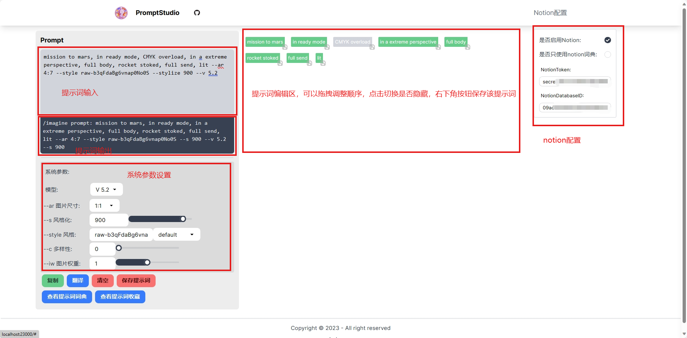
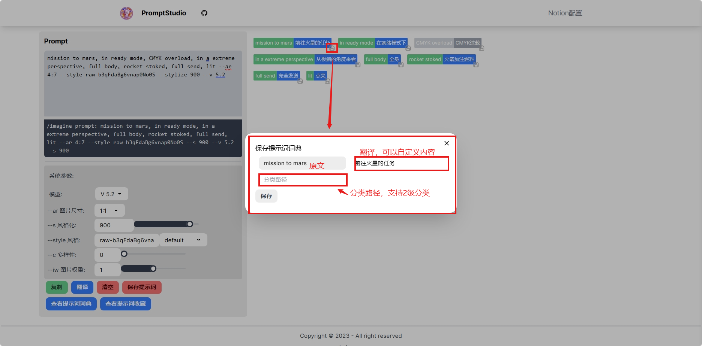
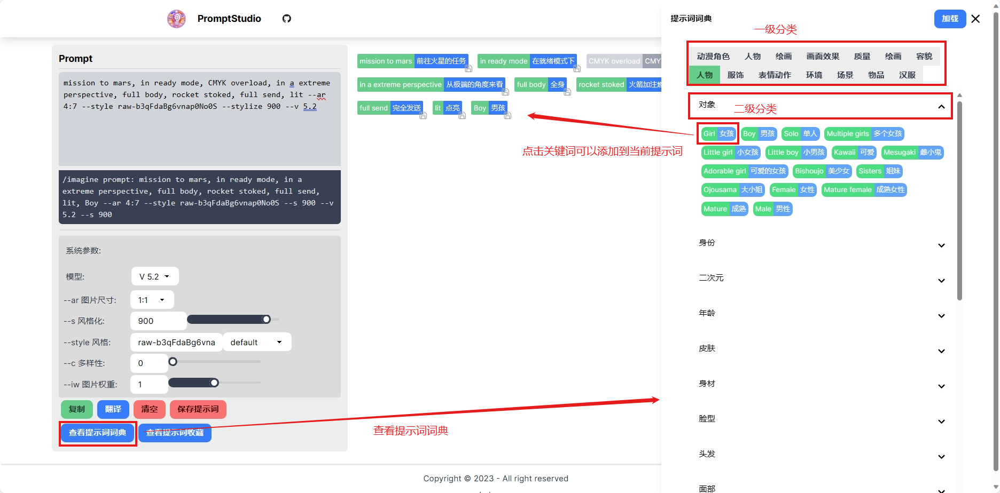
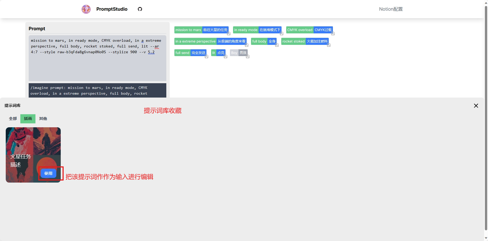

# PromptStudio

## 介绍

个人提示词可视化编辑和管理工具，基于Nextjs+tailwindcss实现。可以方便的编辑和调整提示词的顺序,支持中文翻译,修改系统参数，并且可以保存到notion中,构建自己的私人提示词库。
整体功能和交互参考了[OpenPromptStudio](https://github.com/Moonvy/OpenPromptStudio)的方式，在此基础上增加了提示词的保存功能。使用nextjs实现，可以方便的部署到vercel上。

## 特性

- Vercel一键部署
- 基本的提示词编辑和调整功能，支持常用的系统参数设置
- 提示词分类,词典支持二级分类, 词库支持一级分类
- 支持使用个人notion作为数据库
- 支持英文->中文翻译
- 提示词保存到notion，单个的词组和整个提示词都支持保存，可以添加示例图片。

## 开发计划

- [ ] 优化

    - [x] 提示词分类快速选择
    - 
    - [x] 默认词库和翻译接口添加缓存，减少重复请求

    - [ ] 已在数据库中的词组不再显示保存按钮
    
    - [ ] 优化UI和交互

- [x] 提示词搜索和快速添加

- [x] 支持添加图片提示词(垫图)

- [ ] 支持设置提示词权重

- [ ] 提示词分享成图片

- [ ] 支持提示词模板

- [ ] 支持更多数据库(飞书多维表格，postgresql)

- [ ] 支持更多翻译服务

## 使用

### 提示词编辑



### 保存到词典



### 关键词典使用



### 保存到词库

实例图片只能使用图片链接，不支持上传文件的方式.


## 提示词库查看和使用



## Notion配置

### 1. 复制提示词数据库

复制以下数据库到你Notion，或者自己创建一个满足要求字段的数据库
[Notion演示数据库](https://wide-samba-0b3.notion.site/09ace004e8fc4e95afdfbfc5a689f9ea?v=e62cd1c4760c4b3a9d4a32c23d80eeb4&pvs=4)

#### Notion字段

| 字段名          | 字段类型       | 字段说明                                   |
|--------------|------------|----------------------------------------|
| text         | title      | 词典的提示词原文, 词库的提示词标题                     |
| trans_text   | text       | 词典的提示词翻译                               |
| category     | select     | 一级分类                                   |
| type         | select     | 提示词类型: 提示词典、提示词库                       |
| dir          | select     | 提示词典分类路径,格式: 一级分类/二级分类, 仅支持二级分类,只有词典支持 |
| raw_prompt   | text       | 提示词库用于保存原始的提示词, 词典不需要使用                |
| desc         | text       | 提示词库用于提示词描述                            |
| sample_image | file&media | 提示词库用于保存示例图片连接, 词典不需要使用                |

## 开发

1. 安装依赖
``` bash
npm install
```
2. 配置环境变量
翻译需要配置腾讯云翻译服务的秘钥, 保存到环境变量中, 关键词不是自动翻译，所以不配置也可以运行
``` dotenv
TENCENTCLOUD_SECRET_ID=YOUR_SECRET_ID
TENCENTCLOUD_SECRET_KEY=YOUR_SECRET_KEY
```

3. 启动开发服务器

```bash
npm run dev
```
启动后访问 http://localhost:3000


## 部署

### Vercel 部署

Vercel一键部署[](https://vercel.com/new/import?s=https%3A%2F%2Fgithub.com%2Fpyronn%2Fprompt-studio&hasTrialAvailable=1&showOptionalTeamCreation=false&project-name=prompt-studio&framework=nextjs&totalProjects=1&remainingProjects=1)

需要翻译的在环境变量中配置腾讯翻译服务的秘钥
``` dotenv
TENCENTCLOUD_SECRET_ID=YOUR_SECRET_ID
TENCENTCLOUD_SECRET_KEY=YOUR_SECRET_KEY
```

### Docker部署

TODO ...
